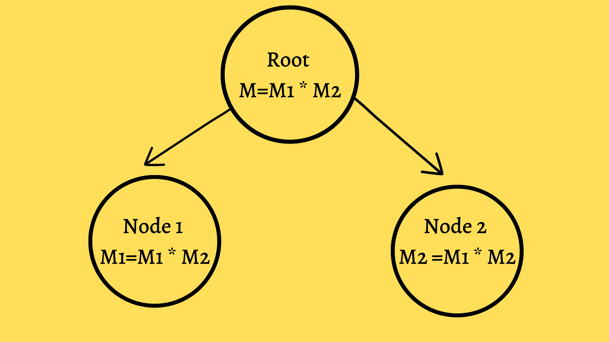

# Parallel-Programming-Algorithms-visualizar

# Algorithm 1 :- Matrix Chain Multiplication

✔️ What is Matrix Chain Multiplication (MCM) ?

🟠 Matrix chain multiplication is the process of multiplying multiple matrices with only a few arithmetic operations.
🟠The trick is to place parenthesis in such an order that the result is computed with only a few number of steps.

Ex:-

## Suppose we have chain of matrices A1,A2,A3, and A4.

Compute the product of A1A2A3A4

Following are the different ways to compute the final answer : -

1.  (A1(A2(A3A4)))
2.  (A1(A2A3)A4)
3.  ((A1A2)(A3A4))
4.  ((A1(A2A3))A4)
5.  ((((A1A2))A3)A4)

## Different Methods to solve MCM

📌 Brute Force ➖ Compute the normal matrix multiplication on every possible combination out of given matrices.

📌 Optimized Method ➖ Using Dynamic Programming .

### Now we will focus on , how to solve MCM using parallel compution .

🔲 Aim :
 
📌 Understanding how parallel component can be added in this problem.
 
📌 Understanding working of MCM using different processors.
 
📌 Understanding how task can be divided among the processors , so that total speed and efficiency of program will be increased.

### 📌 General Idea:-

Let's say M = (M1*M2) * (M3*M4)

Following is the basic model for computing matrix chain product on parallel machine .

# 🎗️ MCM Visualization for 4 number of processors.

https://cs.iupui.edu/~fgsong/LearnHPC/summa/index.html

 

